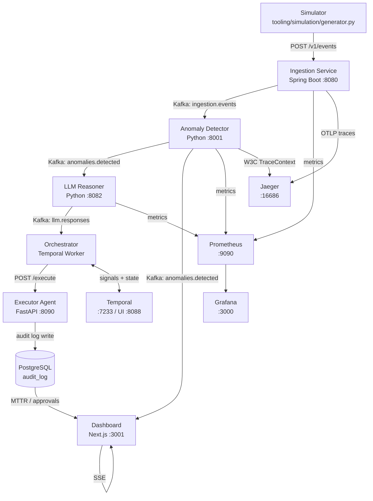

# AIRA — AI-driven Incident Response & Anomaly Detection

AIRA ingests infrastructure events, detects anomalies using rule-based and ML approaches, and runs LLM-assisted root-cause analysis through durable Temporal workflows — all the way to dry-run Kubernetes remediation. Built as a 30-day end-to-end prototype demonstrating Kafka, Temporal, Isolation Forest, and full observability in a single composable system.

[](https://github.com/a0yan/alive/actions/workflows/ci.yml)


---

## Architecture



---

## Run in 60 Seconds

**Prerequisites:** Docker + Docker Compose

```bash
# 1. Configure environment
cp .env.example .env
# Edit .env — add OPENAI_API_KEY or ANTHROPIC_API_KEY if you want LLM reasoning

# 2. Start all services (Kafka health check runs automatically before app services start)
docker-compose up

# 3. Send simulated events (~5% anomaly rate)
python tooling/simulation/generator.py
```

Once running, open:

| UI | URL |
|---|---|
| Dashboard (live anomaly feed) | http://localhost:3001 |
| Grafana (metrics dashboards) | http://localhost:3000 |
| Temporal (workflow executions) | http://localhost:8088 |
| Jaeger (distributed traces) | http://localhost:16686 |
| Prometheus | http://localhost:9090 |

---

## Key Engineering Decisions

**Kafka for event transport** — async decoupling means LLM latency (~2s per call) never blocks anomaly detection throughput; Kafka also enables replay so historical events can be reprocessed with a new model without touching the ingestion path.

**Temporal for orchestration** — workflow state is event-sourced and survives worker crashes; the heartbeat pattern on the LLM activity makes a slow external API call safely retryable without double-executing downstream actions.

**SSE not WebSockets for the dashboard** — server-sent events work over plain HTTP/1.1 with no upgrade handshake and no extra infrastructure; sufficient for a one-directional live feed and simpler to deploy behind a standard reverse proxy.

**`dry_run="All"` on the Kubernetes executor** — the executor calls the real Kubernetes API with dry-run mode, which reads live cluster state and produces a full diff of what *would* change; demonstrates genuine capability without requiring a production cluster or risking unintended mutations.

**Isolation Forest for anomaly ML** — the contamination parameter maps directly to the expected anomaly rate (~5%), training requires no labels and converges on ~1800 samples, and the model handles multivariate payloads (latency + error rate together) natively.

---

## Observability

All services emit Prometheus metrics. Traces propagate via W3C TraceContext headers on Kafka messages, visible end-to-end in Jaeger.

| Tool | URL | Purpose |
|---|---|---|
| Grafana | http://localhost:3000 | Pre-built dashboards (auto-provisioned) |
| Prometheus | http://localhost:9090 | Raw metrics + alerting |
| Jaeger | http://localhost:16686 | Distributed traces |
| Temporal UI | http://localhost:8088 | Workflow execution history |

Three Grafana dashboards load automatically on first start:

- **System Health** — Kafka consumer lag, events/sec, anomalies/sec by type, ingestion p95 latency, DLQ rate
- **LLM Reasoning** — LLM request rate, latency p50/p95/p99, confidence score distribution, auto-execute vs. manual approval ratio
- **Audit/Business** — anomalies by source service, MTTR (queries PostgreSQL directly), pending approvals count

---

## Configuration

All tuneable values live in `.env` (never committed). Copy `.env.example` to get started.

| Variable | Default | Purpose |
|---|---|---|
| `KAFKA_BROKER` | `kafka:29092` | Kafka bootstrap server |
| `LATENCY_THRESHOLD` | `2.0` | Seconds above which a metric event triggers a HighLatency anomaly |
| `DETECTION_MODE` | `rule-only` | `rule-only` \| `ml-only` \| `hybrid` |
| `ANOMALY_CONFIDENCE_THRESHOLD` | `0.8` | LLM confidence above which actions auto-execute (below → human approval) |
| `LLM_PROVIDER` | `openai` | `openai` \| `anthropic` \| `groq` \| `together` \| `ollama` \| `huggingface` |
| `LLM_MODEL` | provider default | Model name for the chosen provider (e.g. `gpt-4o-mini`, `mistral`) |
| `LLM_BASE_URL` | provider default | Override endpoint (self-hosted / proxy) |
| `OPENAI_API_KEY` / `ANTHROPIC_API_KEY` / `GROQ_API_KEY` / `TOGETHER_API_KEY` / `HF_TOKEN` | — | Only the active provider's key is required; `ollama` needs none |
| `POSTGRES_USER` | — | PostgreSQL credentials |
| `POSTGRES_PASSWORD` | — | PostgreSQL credentials |
| `POSTGRES_DB` | — | Database name |

**Offline demo (no API key):** set `LLM_PROVIDER=ollama` and `LLM_MODEL=mistral`, run `ollama serve` on the host — the reasoner reaches it via `host.docker.internal`. Any OpenAI-compatible endpoint also works via `LLM_BASE_URL`.
